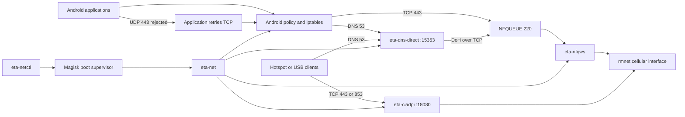

# eta-netctl - best way to have fun w/ isp

Minimal Android ARM64 cellular networking bundle. It manages the packet rules,
DNS helper, NFQUEUE process, tethering helper, health checks, and boot lifecycle.


# DISCLAIMER  

Do not use this for any illegal purposes, "free internet purposes"
Obey your ISP defined metered limitations, avoid overdrafting  
This may not work on every APN/ISP, examples are mine case very specific configuration.

> You may consider this exact if you've unlimited/whitelisted secure accessible connection to somewhere.

## Data flow



The local application path modifies only the initial TLS packets in NFQUEUE.
The destination address remains unchanged. DNS is redirected to the local
helper. QUIC is rejected quickly so applications retry over the managed TCP
path. Hotspot and USB clients use the transparent `eta-ciadpi` listener.

## Requirements

- ARM64 Android device
- Magisk root with working `su`
- Termux installed at `/data/data/com.termux`
- cellular data interface named `rmnetN`
- kernel NFQUEUE support and readable `/proc/net/netfilter/nfnetlink_queue`
- Android `iptables` support for owner, mark, connbytes, REDIRECT, and NFQUEUE
- Termux packages: `bash`, `curl`, `dnsutils`, `gawk`, `grep`, `iproute2`

The included primary path is NFQUEUE. `eta-tun-direct.yml` is only a fallback
profile; an `eta-tun2socks` binary is not included in this minimal repository.
Stop other VPN or packet-routing applications before installation.

The boot supervisor is cellular-only: it waits for an `rmnetN` default route
and disables Wi-Fi before starting the session.

## Install

Install the Termux dependencies inside Termux:

```bash
pkg update
pkg install bash curl dnsutils gawk grep iproute2
```

From the workstation, copy this repository to the device:

```bash
adb push . /data/local/tmp/eta-netctl
adb shell
```

Then install the files from the Android root shell:

```sh
su

ETA_SRC=/data/local/tmp/eta-netctl
TERMUX_PREFIX=/data/data/com.termux/files/usr
TERMUX_HOME=/data/data/com.termux/files/home

mkdir -p /data/adb/eta-net /data/adb/service.d "$TERMUX_HOME/.local/bin"

TERMUX_OWNER=$(stat -c '%u:%g' "$TERMUX_HOME")

cp "$ETA_SRC/eta-net" "$TERMUX_PREFIX/bin/eta-net"
cp "$ETA_SRC/eta-netctl" "$TERMUX_PREFIX/bin/eta-netctl"
cp "$ETA_SRC/bin/eta-ciadpi" "$TERMUX_HOME/.local/bin/eta-ciadpi"
cp "$ETA_SRC/bin/eta-dns-direct" "$TERMUX_HOME/.local/bin/eta-dns-direct"
cp "$ETA_SRC/bin/eta-nfqws" /data/adb/eta-net/eta-nfqws
cp "$ETA_SRC/eta-tun-direct.yml" /data/adb/eta-net/eta-tun-direct.yml
cp "$ETA_SRC/eta-net-magisk-service.sh" /data/adb/service.d/eta-net.sh

chown "$TERMUX_OWNER" \
    "$TERMUX_PREFIX/bin/eta-net" \
    "$TERMUX_PREFIX/bin/eta-netctl" \
    "$TERMUX_HOME/.local" \
    "$TERMUX_HOME/.local/bin" \
    "$TERMUX_HOME/.local/bin/eta-ciadpi" \
    "$TERMUX_HOME/.local/bin/eta-dns-direct"

chmod 0755 \
    "$TERMUX_PREFIX/bin/eta-net" \
    "$TERMUX_PREFIX/bin/eta-netctl" \
    "$TERMUX_HOME/.local/bin/eta-ciadpi" \
    "$TERMUX_HOME/.local/bin/eta-dns-direct" \
    /data/adb/eta-net/eta-nfqws \
    /data/adb/service.d/eta-net.sh
chmod 0644 /data/adb/eta-net/eta-tun-direct.yml
```

Start the supervisor without rebooting:

```sh
su -c /data/adb/service.d/eta-net.sh
```

Return to Termux and start the default all-app cellular profile:

```bash
eta-netctl start \
  --transport direct \
  --direct-stack nfqueue \
  --all-apps \
  --no-restart-apps
```

Magisk will run the supervisor automatically after the next reboot.

## Check and control

```bash
eta-netctl status
eta-netctl logs current
curl -4 --max-time 10 https://www.google.com/generate_204
```

Expected status:

```text
eta-net active, nfqueue app path healthy
```

Useful lifecycle commands:

```bash
eta-netctl restart
eta-netctl stop
eta-netctl start
eta-netctl reset
```

Override the default decoy pool when needed:

```bash
eta-netctl restart \
  --fake-sni-pool 'mmg.whatsapp.net,foo.whatsapp.net,media.whatsapp.net'
```


Do not use these if your ISP allows you to secure connection. These do depend on country, ISP; best practice is to spot few doors where SNI drops certificate without device's, this is feasible on some ISP.
Moreover government pages can be accessible even when you're out of internet, best case can be unlimited social, unlimited * things that ISP advertises. You can check whether you can use those doors as reliable decoy pool.
Mine for instance, allows unmetered infinite amount of internet usage on whatsapp; if this is your case few subdomains/SNI w/ confirmations you might end up something like an example on top.

> Why multiple cause to prevent abusing too many packets on single traffic, boarding our possibilities also lowering the suspiciousness...

## Files

- `eta-net` — network session manager
- `eta-netctl` — service control command
- `eta-net-magisk-service.sh` — Magisk boot supervisor
- `eta-tun-direct.yml` — optional direct TUN fallback profile
- `bin/eta-ciadpi` — transparent TCP helper for Android ARM64
- `bin/eta-nfqws` — NFQUEUE helper for Android ARM64
- `bin/eta-dns-direct` — local DNS helper for Android ARM64
- `etadns` — source and tests for `eta-dns-direct`
