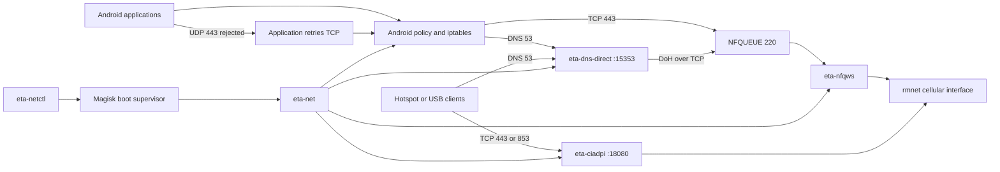

# eta-netctl — a practical way to have fun with your ISP

Minimal Android ARM64 cellular networking bundle. It manages the packet rules,
DNS helper, NFQUEUE process, tethering helper, health checks, and boot lifecycle.

Tested on an Exynos 2400 device over 5G, where the direct NFQUEUE path reached
gigabit-class throughput. This is a device-and-network result, not a guaranteed
speed: radio conditions, carrier policy, modem, APN, and destination capacity
remain the limiting factors.

# DISCLAIMER

Do not use this for illegal activity or to avoid metered-service charges, overdrafting.
Respect the limits and terms defined by your ISP.
This may not work on every APN or ISP; the included defaults come from one
specific network configuration.

> Consider this approach only when your plan already provides an unlimited or
> explicitly accessible TLS service that can be used for classification tests.

## Data flow



The local application path modifies only the initial TLS packets in NFQUEUE.
The destination address remains unchanged. DNS is redirected to the local
helper. QUIC is rejected quickly so applications retry over the managed TCP
path. Hotspot and USB clients use the transparent `eta-ciadpi` listener.

## Requirements

- ARM64 Android device
- Magisk root with working `su`
- Termux installed at `/data/data/com.termux`
- cellular data interface named `rmnetN`
- kernel NFQUEUE support and readable `/proc/net/netfilter/nfnetlink_queue`
- Android `iptables` support for owner, mark, connbytes, REDIRECT, and NFQUEUE
- Termux packages: `bash`, `curl`, `dnsutils`, `gawk`, `grep`, `iproute2`

The included primary path is NFQUEUE. `eta-tun-direct.yml` is only a fallback
profile; an `eta-tun2socks` binary is not included in this minimal repository.
Stop other VPN or packet-routing applications before installation.

The boot supervisor is cellular-only: it waits for an `rmnetN` default route
and disables Wi-Fi before starting the session.

## Install

Install the Termux dependencies inside Termux:

```bash
pkg update
pkg install bash curl dnsutils gawk grep iproute2
```

From the workstation, copy this repository to the device:

```bash
adb push . /data/local/tmp/eta-netctl
adb shell
```

Then install the files from the Android root shell:

```sh
su

ETA_SRC=/data/local/tmp/eta-netctl
TERMUX_PREFIX=/data/data/com.termux/files/usr
TERMUX_HOME=/data/data/com.termux/files/home

mkdir -p /data/adb/eta-net /data/adb/service.d "$TERMUX_HOME/.local/bin"

TERMUX_OWNER=$(stat -c '%u:%g' "$TERMUX_HOME")

cp "$ETA_SRC/eta-net" "$TERMUX_PREFIX/bin/eta-net"
cp "$ETA_SRC/eta-netctl" "$TERMUX_PREFIX/bin/eta-netctl"
cp "$ETA_SRC/eta-decoy-check" "$TERMUX_PREFIX/bin/eta-decoy-check"
cp "$ETA_SRC/bin/eta-ciadpi" "$TERMUX_HOME/.local/bin/eta-ciadpi"
cp "$ETA_SRC/bin/eta-dns-direct" "$TERMUX_HOME/.local/bin/eta-dns-direct"
cp "$ETA_SRC/bin/eta-nfqws" /data/adb/eta-net/eta-nfqws
cp "$ETA_SRC/eta-tun-direct.yml" /data/adb/eta-net/eta-tun-direct.yml
cp "$ETA_SRC/eta-net-magisk-service.sh" /data/adb/service.d/eta-net.sh

chown "$TERMUX_OWNER" \
    "$TERMUX_PREFIX/bin/eta-net" \
    "$TERMUX_PREFIX/bin/eta-netctl" \
    "$TERMUX_PREFIX/bin/eta-decoy-check" \
    "$TERMUX_HOME/.local" \
    "$TERMUX_HOME/.local/bin" \
    "$TERMUX_HOME/.local/bin/eta-ciadpi" \
    "$TERMUX_HOME/.local/bin/eta-dns-direct"

chmod 0755 \
    "$TERMUX_PREFIX/bin/eta-net" \
    "$TERMUX_PREFIX/bin/eta-netctl" \
    "$TERMUX_PREFIX/bin/eta-decoy-check" \
    "$TERMUX_HOME/.local/bin/eta-ciadpi" \
    "$TERMUX_HOME/.local/bin/eta-dns-direct" \
    /data/adb/eta-net/eta-nfqws \
    /data/adb/service.d/eta-net.sh
chmod 0644 /data/adb/eta-net/eta-tun-direct.yml
```

Start the supervisor without rebooting:

```sh
su -c /data/adb/service.d/eta-net.sh
```

Return to Termux and start the default all-app cellular profile:

```bash
eta-netctl start \
  --transport direct \
  --direct-stack nfqueue \
  --all-apps \
  --no-restart-apps
```

Magisk will run the supervisor automatically after the next reboot.

## Check and control

```bash
eta-netctl status
eta-netctl logs current
curl -4 --max-time 10 https://www.google.com/generate_204
```

Expected status:

```text
eta-net active, nfqueue app path healthy
```

Useful lifecycle commands:

```bash
eta-netctl restart
eta-netctl stop
eta-netctl start
eta-netctl reset
```

Override the default decoy pool when needed:

```bash
eta-netctl restart \
  --fake-sni-pool 'mmg.whatsapp.net,foo.whatsapp.net,media.whatsapp.net'
```

## Find a small decoy pool

`eta-decoy-check` tests a short candidate list against one HTTPS control URL.
It starts an isolated root-owned SOCKS listener, performs several fresh TLS
connections per candidate, removes the listener, and prints only candidates
that passed every attempt. It does not scan addresses and does not change the
running `eta-net` configuration.
Grant Termux root access if Magisk prompts during the test.

Run the built-in candidates:

```bash
eta-decoy-check
```

Test names that are already accessible under your own ISP plan:

```bash
eta-decoy-check service-one.example service-two.example
```

Use more attempts or another known HTTPS control page:

```bash
eta-decoy-check \
  --attempts 5 \
  --url https://www.google.com/generate_204 \
  service-one.example service-two.example
```

If local DNS is unreliable, pin a current address for that same control host:

```bash
eta-decoy-check \
  --target-ip 142.250.186.132 \
  service-one.example service-two.example
```

Example output:

```text
control: www.google.com -> 142.251.151.4

candidate                         result   avg TLS
mmg.whatsapp.net                  3/3      0.194s
foo.whatsapp.net                  3/3      0.201s

Stable pool:
eta-netctl restart --fake-sni-pool 'mmg.whatsapp.net,foo.whatsapp.net'
```

Run the test on cellular data with Wi-Fi disabled. A successful result means
the control origin completed TLS and returned HTTP; a certificate observed on
a candidate's own address is not sufficient. Re-run the test at different
times before treating a name as stable.

Do not use a decoy when an ordinary secure connection already works. Results
depend on country, carrier, APN, destination, and time. A useful candidate is a
hostname that your own plan explicitly permits and that repeatedly passes the
control request when used only in the initial classification packet.

Some plans retain access to selected public or social services after the
general allowance is exhausted. Test only services included in your own plan,
and confirm every candidate with several connections before adding it to a
pool. The destination remains the control origin; the named service is not a
relay or proxy.

> Why multiple names? A small verified pool improves resilience when one
> classifier rule changes. It does not change accounting or make traffic
> invisible.

## Files

- `eta-net` — network session manager
- `eta-netctl` — service control command
- `eta-decoy-check` — bounded decoy-candidate tester
- `eta-net-magisk-service.sh` — Magisk boot supervisor
- `eta-tun-direct.yml` — optional direct TUN fallback profile
- `bin/eta-ciadpi` — transparent TCP helper for Android ARM64
- `bin/eta-nfqws` — NFQUEUE helper for Android ARM64
- `bin/eta-dns-direct` — local DNS helper for Android ARM64
- `etadns` — source and tests for `eta-dns-direct`
